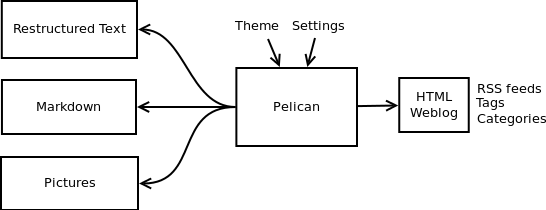
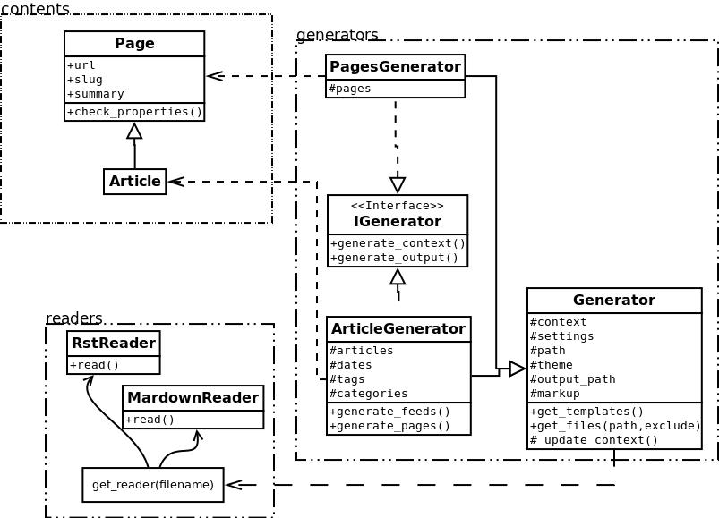

Some history about Pelican
##########################

.. warning::

    This page comes from a report the original author (Alexis Métaireau) wrote
    right after writing Pelican, in December 2010. The information may not be
    up-to-date.

Pelican is a simple static blog generator. It parses markup files
(Markdown or reStructuredText for now) and generates an HTML folder
with all the files in it.
I've chosen to use Python to implement Pelican because it seemed to
be simple and to fit to my needs. I did not wanted to define a class for
each thing, but still wanted to keep my things loosely coupled.
It turns out that it was exactly what I wanted. From time to time,
thanks to the feedback of some users, it took me a very few time to
provide fixes on it. So far, I've re-factored the Pelican code by two
times; each time took less than 30 minutes.

Use case
========

I was previously using WordPress, a solution you can host on a web
server to manage your blog. Most of the time, I prefer using markup
languages such as Markdown or reStructuredText to type my articles.
To do so, I use vim. I think it is important to let the people choose the
tool they want to write the articles. In my opinion, a blog manager
should just allow you to take any kind of input and transform it to a
weblog. That's what Pelican does.
You can write your articles using the tool you want, and the markup
language you want, and then generate a static HTML weblog.

To be flexible enough, Pelican has template support, so you can easily write
your own themes if you want to.

Design process
==============

Pelican came from a need I have. I started by creating a single file
application, and I have make it grow to support what it does by now.
To start, I wrote a piece of documentation about what I wanted to do.
Then, I created the content I wanted to parse (the reStructuredText files)
and started experimenting with the code. Pelican was 200 lines long and
contained almost ten functions and one class when it was first usable.

I have been facing different problems all over the time and wanted to
add features to Pelican while using it. The first change I have done was
to add the support of a settings file. It is possible to pass the options to
the command line, but can be tedious if there is a lot of them.
In the same way, I have added the support of different things over
time: Atom feeds, multiple themes, multiple markup support, etc.
At some point, it appears that the "only one file" mantra was not good
enough for Pelican, so I decided to rework a bit all that, and split this in
multiple different files.

I’ve separated the logic in different classes and concepts:

* *writers* are responsible of all the writing process of the files.
  They are responsible of writing .html files, RSS feeds and so on.
  Since those operations are commonly used, the object is created
  once, and then passed to the generators.

* *readers* are used to read from various formats (Markdown and
  reStructuredText for now, but the system is extensible). Given a
  file, they return metadata (author, tags, category, etc) and
  content (HTML formatted).

* *generators* generate the different outputs. For instance, Pelican
  comes with an ArticlesGenerator and PagesGenerator, into
  others. Given a configuration, they can do whatever you want
  them to do. Most of the time it's generating files from inputs
  (user inputs and files).

I also deal with contents objects. They can be ``Articles``, ``Pages``,
``Quotes``, or whatever you want. They are defined in the ``contents.py``
module and represent some content to be used by the program.

In more detail
==============

Here is an overview of the classes involved in Pelican.

The interface does not really exist, and I have added it only to clarify the
whole picture. I do use duck typing and not interfaces.

Internally, the following process is followed:

* First of all, the command line is parsed, and some content from
  the user is used to initialize the different generator objects.

* A ``context`` is created. It contains the settings from the command
  line and a settings file if provided.
* The ``generate_context`` method of each generator is called, updating
  the context.

* The writer is created and given to the ``generate_output`` method of
  each generator.

I make two calls because it is important that when the output is
generated by the generators, the context will not change. In other
words, the first method ``generate_context`` should modify the context,
whereas the second ``generate_output`` method should not.

Then, it is up to the generators to do what the want, in the
``generate_context`` and ``generate_content`` method.
Taking the ``ArticlesGenerator`` class will help to understand some others
concepts. Here is what happens when calling the ``generate_context``
method:

* Read the folder “path”, looking for restructured text files, load
  each of them, and construct a content object (``Article``) with it. To do so,
  use ``Reader`` objects.
* Update the ``context`` with all those articles.

Then, the ``generate_content`` method uses the ``context`` and the ``writer`` to
generate the wanted output.
